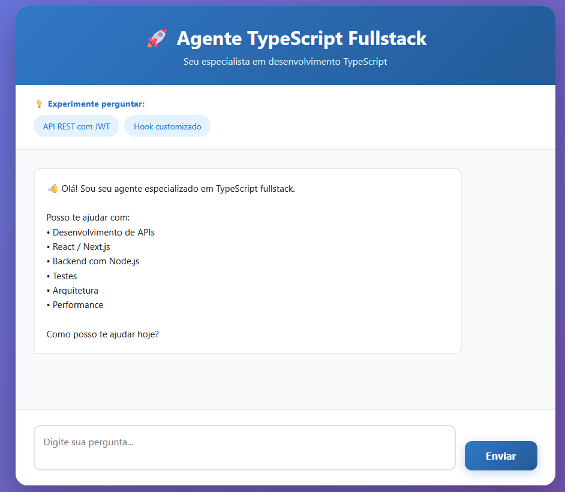

# Mentor TypeScript - Agente Fullstack

Este projeto é um assistente de IA especializado em desenvolvimento TypeScript Fullstack, construído com [Next.js](https://nextjs.org) e integrado ao [Ollama](https://ollama.ai) para processamento local de linguagem natural.



## 🚀 Funcionalidades

- **Chat Interativo**: Interface amigável para conversar com o agente.
- **Respostas em Streaming**: Visualização das respostas token por token em tempo real.
- **Especialista em TS**: O agente é configurado para auxiliar em TypeScript, Node.js, React, testes e arquitetura.
- **Sugestões Rápidas**: Exemplos de prompts prontos para testar as capacidades do agente.
- **Design Moderno**: Interface limpa e responsiva estilizada com TailwindCSS.

## 🛠️ Tecnologias Utilizadas

- **Frontend**: [Next.js 16](https://nextjs.org) (App Router), React 19.
- **Estilização**: [TailwindCSS v4](https://tailwindcss.com).
- **IA / LLM**: [Ollama](https://ollama.ai) (Local LLM Server).
- **Linguagem**: TypeScript.

## 📋 Pré-requisitos

Antes de rodar o projeto, você precisa configurar o ambiente:

1.  **Node.js**: Certifique-se de ter o Node.js instalado (versão 20 ou superior recomendada).
2.  **Ollama**: Instale o [Ollama](https://ollama.ai/download) em sua máquina.
3.  **Modelo LLM**: O projeto está configurado para usar o modelo `deepseek-coder:6.7b`. Você precisa baixá-lo via Ollama:

    ```bash
    ollama pull deepseek-coder:6.7b
    ```

    > **Nota**: Se desejar usar outro modelo, altere a string `"model"` no arquivo `services/ollama.ts`.

## 📦 Instalação e Uso

1.  Clone o repositório e entre na pasta:
    ```bash
    cd agent-ts
    ```

2.  Instale as dependências:
    ```bash
    npm install
    # ou
    yarn install
    # ou
    pnpm install
    ```

3.  Inicie o servidor de desenvolvimento:
    ```bash
    npm run dev
    ```

4.  Abra [http://localhost:3000](http://localhost:3000) no seu navegador.

## 🔧 Estrutura do Projeto

```
app/
 ├── page.tsx              # Interface principal do chat
 ├── layout.tsx            # Layout raiz da aplicação
 ├── globals.css           # Estilos globais (TailwindCSS)
 └── api/
     └── prompt/
         └── route.ts      # Proxy API para o Ollama
services/
 └── ollama.ts             # Comunicação com o servidor Ollama
lib/
 └── validators.ts         # Validações e utilitários
public/                    # Arquivos estáticos
```

## 🤝 Contribuição

Sinta-se à vontade para abrir issues ou enviar PRs para melhorar este agente!


## Autor

Desenvolvido por Chagas Barros

- [LinkedIn](https://www.linkedin.com/in/chagasbarros)
- [Portifólio](https://www.chagasbarros.com.br)


